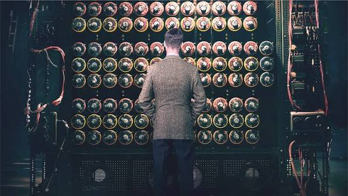
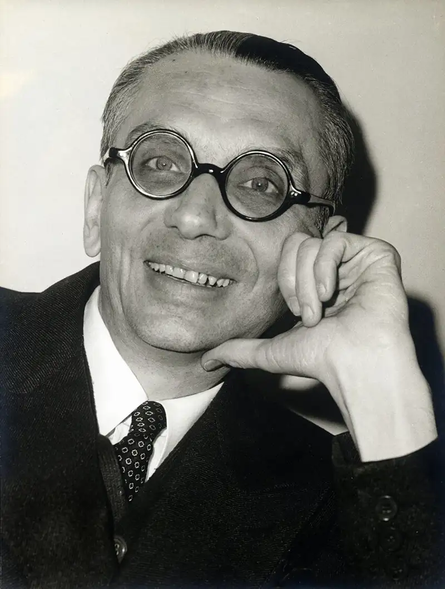
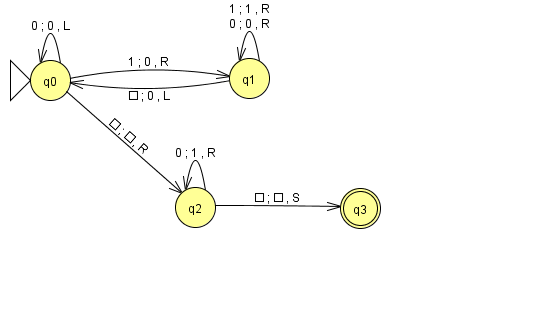
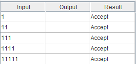
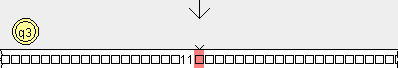
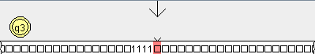
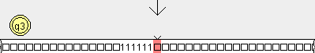
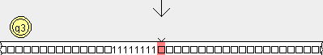
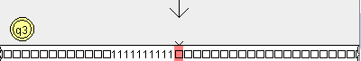

# 💻 Computabilidad y Complejidad

**Universidad Nacional de Hurlingham**  
*2° Cuatrimestre 2026*

---

 

  

---

## 📂 Índice de tareas

| Tarea | Descripción | Enlace |
| :---: | :--- | :---: |
| **T1** | Trabajo práctico 1: Científicos | [Ver carpeta](./T1/) |
| **T2** | Trabajo práctico 2: Máquinas de Turing | [Ver carpeta](./T2/) |
| **T3** | Trabajo práctico 2: Máquinas de Turing con distitos lenguajes| [Ver carpeta](./T3/) |

---

## Tarea 1: Científicos

 **Recursos adicionales:** 
 - [Carpeta T1](./T1/) 
 - [Hoja de Cálculo en Google Drive](https://docs.google.com/spreadsheets/d/19Bz7HpqyY465uTSSMZl_xUvJH9eviDKqdAx2mwPVTQA/edit?usp=sharing)

 

<table>
  <tr>
    <td width="240" align="center" valign="top">
      
    </td>
    <td valign="top">
      <h3>Kurt Friedrich Gödel</h3>
      
<b>Profesión:</b> Lógico, matemático y filósofo

      <ul>
        <li><b>Fechas:</b> 28/04/1906 – 14/01/1978</li>
        <li><b>Nacionalidad:</b> Checoslovaca, Austriaca, Estadounidense</li>
        <li><b>Educación:</b> Universidad de Viena (Tesis: <i>Über die Vollständigkeit des Logikkalküls</i>)</li>
        <li><b>Aporte principal:</b> Teoremas de incompletitud (1931)</li>
      </ul>
    </td>
  </tr>
</table>

### Aportes y conceptos asociados
- Teoremas de completitud e incompletitud
- Numeración de Gödel
- Teoría de conjuntos de Von Neumann-Bernays-Gödel
- Métrica de Gödel y Universo constructible

### Reconocimientos
- **Premio Albert Einstein (1951):** Por grandes contribuciones en ciencias naturales.
- **Medalla Nacional de Ciencia (1974):** Galardón en ciencias físicas.

### Aplicación en Ciencias de la Computación
Su trabajo establece un límite fundamental sobre los sistemas formales:
- **Problema de la detención:** Alan Turing se basó en los teoremas de Gödel para demostrar las limitaciones de los algoritmos.
- **Inteligencia Artificial:** Define el alcance y los límites deductivos de los sistemas basados en reglas y axiomas (p. ej., Prolog).

-  **Curiosidad:** Padecía una paranoia obsesiva a ser envenenado y solo consumía alimentos preparados por su esposa Adele. Durante una hospitalización prolongada de ella en 1977, Gödel se rehusó a comer, lo que provocó su fallecimiento por desnutrición.

---

# Tarea 2: Maquina de Turing

 **Recursos adicionales:** 
 - [Carpeta T2](./T2/) 

## Maquina

### Ejemplos

#### Input "1"

#### Input "11"

#### Input "111"

#### Input "1111"

#### Input "11111"

---

# Tarea 3: Maquinas de Turing con distintos lenguajes

 **Recursos adicionales:** 
 - [Carpeta T3](./T3/) 

---

## 🛠️ Recursos

- [JFLAP - Formal Languages and Automata Package](https://www.jflap.org/)