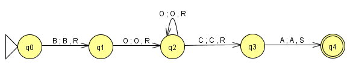

# Tarea 3: Más Maquinas de Turing

## MT Lenguaje Regular 
-

### Ejemplos

## MTAccept vs MTCalc

| Característica | MTAccept (Reconocedora) | MTCalc (Calculadora) |
| :--- | :--- | :--- |
| **Objetivo** | Decidir si una palabra es válida o no. | Calcular un resultado o función matemática. |
| **Resultado** | Un estado de aceptación o rechazo. | Una cadena nueva escrita en la cinta. |
| **Parada de éxito** | Estado final.| Al terminar la computación. |
| **Contenido final** | Lo que queda en la cinta no importa. | Lo que queda en la cinta es la respuesta. |
| **Ejemplo** | Validar si la palabra tiene igual número de O y A. | Duplicar la cantidad de unos de la cinta |